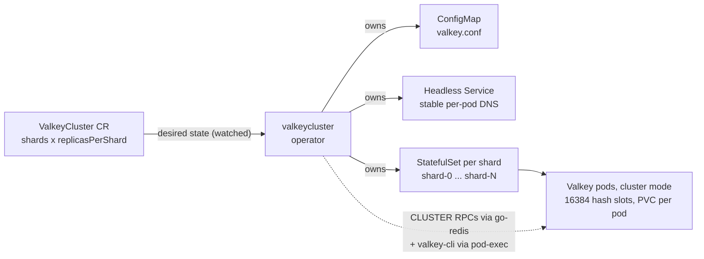
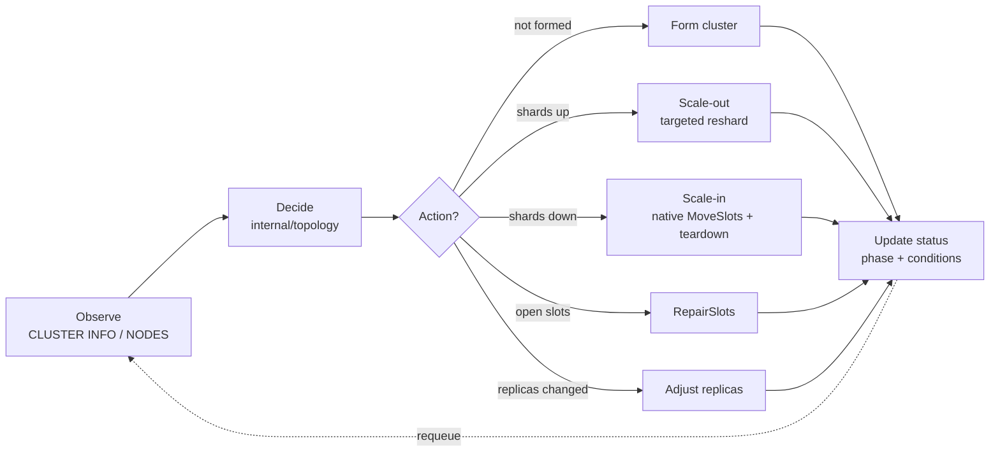

# ValkeyCluster Operator

📖 **Documentation site:** <https://razkevich.github.io/valkeycluster-operator/>

A Kubernetes operator that manages a **Valkey Cluster** (cluster mode) declaratively. You describe
the desired topology — how many shards and how many replicas per shard — in a single `ValkeyCluster`
custom resource, and the operator reconciles a real, sharded, highly-available Valkey cluster to
match: provisioning, forming, **data-preserving resharding** when the topology changes, and
automatic failover via Valkey's built-in cluster mechanism.

```yaml
apiVersion: cache.razkevich.dev/v1alpha1
kind: ValkeyCluster
metadata:
  name: demo
spec:
  shards: 3            # data partitions (1 = HA-only, or >=3); the keyspace is split across them
  replicasPerShard: 1  # HA copies per shard
  image: valkey/valkey:8
  storage:
    size: 1Gi
  haPolicy:            # clustering/HA tuning — see docs/clustering-ha-tradeoffs.md
    minReplicasToWrite: 0
    requireFullCoverage: true
    appendFsync: everysec
    clusterNodeTimeoutMillis: 5000
```

```console
$ kubectl get valkeyclusters
NAME   SHARDS   REPLICAS   PHASE   READY   AGE
demo   3        1          Ready   3       2m
```

## What it does

- **Sharding** — partitions the 16384 hash slots across `shards` primaries (capacity + write scale-out).
- **Replication** — `replicasPerShard` HA copies per shard, spread across nodes (pod anti-affinity).
- **Resharding** — changing `shards` migrates slots *and their keys* to the new layout with **no data loss** (brief unavailability is acceptable).
- **Failover** — Valkey promotes a replica automatically when a primary is lost; the operator reflects it in status and re-joins the recovered node.
- **Truthful status** — `phase` + conditions + per-shard detail derived from the live cluster every reconcile; monitoring is via `kubectl` (no extra metrics stack).

Scope is deliberately focused; see [the spec's non-goals](specs/001-valkeycluster-operator/spec.md#out-of-scope-non-goals-for-this-version)
(no vertical scaling, volume expansion, backup/restore, TLS/ACL, Sentinel, external access).

## Quick start (local, kind)

```sh
make kind-create                                   # 1 control-plane + 2 workers
make kind-deploy IMG=valkeycluster-operator:dev    # build, load, install CRD, deploy operator
kubectl apply -f config/samples/cache_v1alpha1_valkeycluster.yaml
kubectl get valkeycluster valkeycluster-sample -w  # watch it reach Ready
```
Then exercise it (write/read across shards, failover, reshard) following
[docs/day-2-operations.md](docs/day-2-operations.md), or run the full validation guide in
[specs/001-valkeycluster-operator/quickstart.md](specs/001-valkeycluster-operator/quickstart.md).

Make targets of note: `make run` (run the controller locally), `make test` (unit + envtest),
`make test-e2e` (kind e2e), `make kind-redeploy` (rebuild + reload + restart), `bench/benchmark.sh`.

## How it works

**What the operator creates** (owner-referenced, so deletion garbage-collects):



**The reconcile loop** (level-triggered, idempotent — reads live state first, safe to re-run):



- One **StatefulSet per shard** (`<cr>-shard-<i>`), a **headless Service** for stable per-pod DNS,
  and a **ConfigMap** with the rendered `valkey.conf`. Each pod advertises its stable FQDN
  (`cluster-announce-hostname`) so gossip and client redirects survive pod restarts; `nodes.conf`
  lives on the PVC so a restarted node keeps its identity.
- The reconciler observes the live cluster (`CLUSTER INFO`/`NODES` via go-redis), decides the next
  action (`internal/topology`), and acts:
  - **scale-out** — join the new shard's primary and move it its fair share of slots with a
    *targeted* reshard (never `--use-empty-masters`, which would hand slots to replica pods);
  - **scale-in** — drain a departing shard's slots onto a survivor with a **native Go slot-mover**
    (`SETSLOT` + `MIGRATE ... REPLACE` by IP, masters-only `SETSLOT NODE`), then forget its nodes
    cluster-wide and delete its StatefulSet. Teardown is driven by which StatefulSets still exist,
    not by the live primary count;
  - **repair** — `RepairSlots` deterministically finalizes any open (importing/migrating) slots;
  - **form / adjust replicas** for first bootstrap and HA-copy changes.
- The cluster-orchestration seam (`internal/cluster.ClusterAdmin`) has a fake implementation so the
  reconciler is unit/envtest testable without a live Valkey.

Architecture and decisions: [specs/001-valkeycluster-operator/plan.md](specs/001-valkeycluster-operator/plan.md).

## Development methodology

Built spec-first with **GitHub Spec Kit**. The full trail is in the repo:
`.specify/memory/constitution.md` → `specs/001-valkeycluster-operator/{spec,plan,research,data-model,quickstart}.md`
→ `contracts/` → `tasks.md` → implementation. Tests are written alongside the code per the
constitution's test-first principle (unit + controller envtest + kind e2e).

This was built with an AI coding agent under that structure — the spec-driven loop, the test seam,
and verification against a real cluster are written up in
[docs/ai-development.md](docs/ai-development.md).

## Project layout

```
api/v1alpha1/            CRD types (spec/status, validation, printer columns)
internal/cluster/        ClusterAdmin: go-redis RPCs + valkey-cli pod-exec + fake
internal/slots/          hash-slot distribution (pure)
internal/topology/       desired-vs-observed reconcile planner (pure)
internal/resources/      StatefulSet / Service / ConfigMap builders
internal/controller/     the reconciler (form / reshard / failover / status / finalizer)
config/                  kustomize manifests (CRD, RBAC, manager, samples)
bench/                   valkey-benchmark trade-off harness
docs/                    day-2 operations + clustering/HA trade-offs
specs/                   spec-kit artifacts
```
