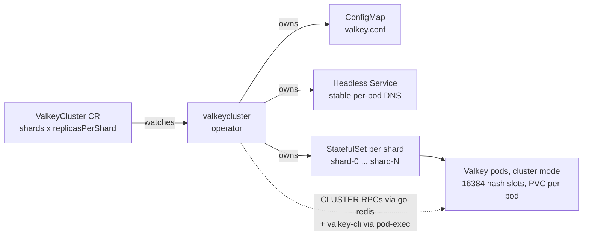
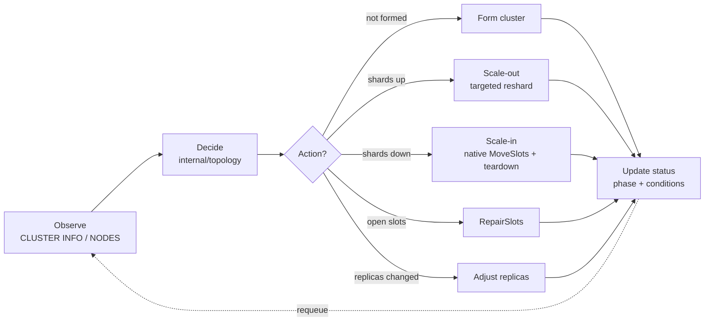

# ValkeyCluster Operator

A Kubernetes operator that manages a **Valkey Cluster** (cluster mode) declaratively. You describe the
desired topology — how many shards and how many replicas per shard — in one `ValkeyCluster` custom
resource, and the operator reconciles a real, sharded, highly-available Valkey cluster to match:
provisioning, forming, **data-preserving resharding** when the topology changes, and automatic
failover via Valkey's built-in cluster mechanism.

```yaml
apiVersion: cache.razkevich.dev/v1alpha1
kind: ValkeyCluster
metadata:
  name: demo
spec:
  shards: 3            # data partitions (1 = HA-only, or >=3); the 16384 hash slots split across them
  replicasPerShard: 1  # HA copies per shard
  image: valkey/valkey:8
  storage:
    size: 1Gi
  haPolicy:
    minReplicasToWrite: 0
    requireFullCoverage: true
    clusterNodeTimeoutMillis: 5000
```

```console
$ kubectl get valkeyclusters
NAME   SHARDS   REPLICAS   PHASE   READY   AGE
demo   3        1          Ready   3       2m
```

## What it does

- **Sharding** — partitions the 16384 hash slots across `shards` primaries (capacity + write scale-out).
- **Replication** — `replicasPerShard` HA copies per shard, spread across nodes (pod anti-affinity).
- **Resharding** — changing `shards` migrates slots *and their keys* to the new layout with **no data loss**.
- **Failover** — Valkey promotes a replica when a primary is lost; the operator reflects it in status and re-joins the recovered node.
- **Truthful status** — `phase` + conditions + per-shard detail derived from the live cluster every reconcile; monitoring is via `kubectl`.

## Architecture at a glance

**What the operator creates** (owner-referenced, so deletion garbage-collects):



**The reconcile loop** (level-triggered, idempotent — reads live state first, safe to re-run):



## Where to go next

| If you want to… | Read |
|---|---|
| Understand the design end-to-end | [Architecture](walkthrough.md) |
| Operate a running cluster | [Day-2 Operations](day-2-operations.md) |
| See how the loop stays correct under failure | [Reconcile Loop & Edge Cases](reconcile-edge-cases.md) |
| Tune for a no-persistence, must-stay-up cache | [Performance Tuning](performance-tuning.md) |
| Understand the HA settings and their tradeoffs | [Clustering & HA Tradeoffs](clustering-ha-tradeoffs.md) |
| See how it's tested | [Testing & Verification](manual-verification.md) |
| How it was built with AI | [AI Development Methodology](ai-development.md) |
