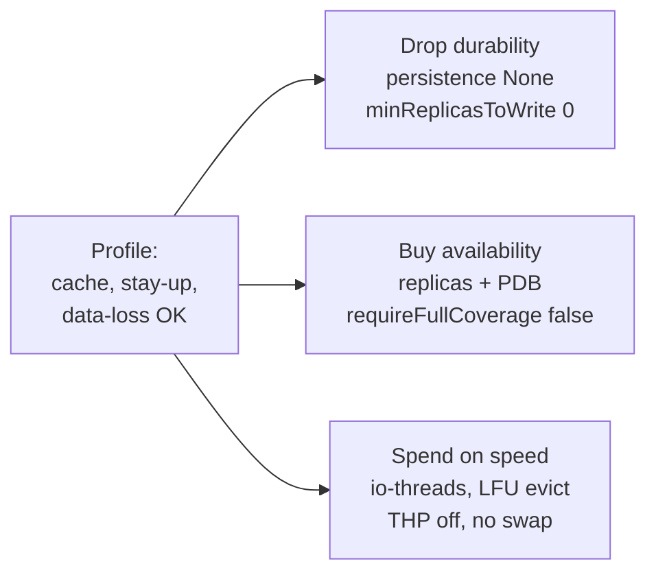

# Performance Tuning — the "in-memory cache" profile

A specific, common workload: **the cluster must stay available, but losing data on failure is
acceptable.** This is a cache, not a system of record. That single fact changes almost every tuning
decision — it lets you trade durability for throughput, tail latency, and availability, on purpose.

This page maps the profile onto three layers: the `ValkeyCluster` CR (what the operator configures),
Valkey runtime settings, and the OS/node prerequisites that live *outside* the operator.

!!! note "The mental model"
    Durability work — fsync, RDB forks, blocking writes until a replica acks — buys you nothing here,
    so turn it off and reclaim the throughput, latency, and memory it was costing. Spend the budget on
    **staying up** instead: replicas for failover, partial-availability over total outage, and node
    settings that keep latency predictable.

## Layer 1 — the ValkeyCluster CR

```yaml
apiVersion: cache.razkevich.dev/v1alpha1
kind: ValkeyCluster
metadata:
  name: cache
spec:
  shards: 3
  replicasPerShard: 1            # availability (fast failover), NOT durability
  resources:
    limits: { memory: 8Gi }      # drives maxmemory
  persistence:
    mode: None                   # no AOF, no RDB — zero disk I/O
  performance:
    ioThreads: 4                 # network parallelism across cores (Valkey 8)
    maxmemoryPolicy: allkeys-lfu # it's a cache: evict cold keys under pressure
  haPolicy:
    minReplicasToWrite: 0        # never block a write for durability we don't want
    requireFullCoverage: false   # keep serving the slots that are up
    clusterNodeTimeoutMillis: 5000
```

Why each choice:

| Knob | Cache-profile value | Rationale |
|---|---|---|
| `persistence.mode` | `None` | No AOF fsync, no RDB fork. Removes the largest sources of tail latency and the copy-on-write memory spike. |
| `haPolicy.requireFullCoverage` | `false` | **The headline "stay up" lever.** By default a node rejects *all* commands if any slot is uncovered. For a cache, serving the slots that *are* up beats a total outage while a shard recovers. |
| `haPolicy.minReplicasToWrite` | `0` | Blocking writes until a replica is in sync buys durability you've explicitly opted out of. |
| `performance.maxmemoryPolicy` | `allkeys-lfu` | Eviction is correct behavior for a cache. LFU beats LRU on skewed/hot-key access patterns. |
| `replicasPerShard` | `≥1` | Still want replicas — not for durability, but so a primary loss fails over in seconds instead of dropping a shard. |
| `performance.ioThreads` | ~ vCPUs − 1 | Valkey 8 fans network I/O across cores; command execution stays single-threaded. The headline Valkey-vs-Redis lever. |

## Layer 2 — Valkey runtime settings

Most of these are what `persistence.mode: None` + the knobs above render into `valkey.conf`; the rest
are worth knowing for discussion.

```ini
# Persistence OFF — no disk I/O at all
appendonly no
save ""                       # disable RDB snapshots

# Memory: it's a cache, so evict
maxmemory <see Layer 3>
maxmemory-policy allkeys-lfu

# Don't block the main thread freeing big objects
lazyfree-lazy-eviction yes
lazyfree-lazy-expire yes
lazyfree-lazy-server-del yes
replica-lazy-flush yes

# Throughput
io-threads 4                  # + io-threads-do-reads yes on very read-heavy loads
tcp-keepalive 60
timeout 0                     # don't drop idle pooled connections

# Read scaling: serve reads from replicas (clients opt in with READONLY)
replica-read-only yes
```

!!! warning "Without persistence you remove the fork — but keep an eye on big keys"
    With no RDB/AOF there is no `fork()`, so no copy-on-write memory doubling and no fork-induced
    latency stall. The remaining main-thread stalls come from **O(N) commands and huge keys** (`KEYS`,
    big `HGETALL`, multi-million-element collections) and from synchronously freeing large keys on
    eviction — which is why `lazyfree-*` is on. Pipeline, pool connections client-side, and avoid
    O(N)-over-the-whole-keyspace commands.

## Layer 3 — OS / node prerequisites (outside the operator)

These are node-level settings the cluster admin applies (via a `Tuned` profile, a privileged init
container, node bootstrap, or `securityContext.sysctls` for the namespaced ones). The operator does
not own the node, so these are prerequisites you arrange separately.

| Setting | Recommendation | Why it matters for an in-memory store |
|---|---|---|
| **Transparent Huge Pages** | `never` | THP causes large, unpredictable latency spikes for Redis/Valkey. The single most important node fix. |
| **Swap** | off (or `vm.swappiness=0`) | A swapped-out hot dataset turns microsecond ops into millisecond ones. K8s nodes typically run swapless already. |
| **`net.core.somaxconn` / `tcp-backlog`** | raise together (e.g. 1024+) | A small accept backlog drops connections under burst; the Valkey backlog must not exceed the kernel's. |
| **File descriptors (`nofile`)** | high (e.g. 100k) | `maxclients` is bounded by the fd limit; a cache often has many connections. |
| **`vm.overcommit_memory`** | `1` | Standard Redis recommendation; harmless here even without forking. |
| **CPU governor / throttling** | `performance`, avoid CFS throttling | Latency-sensitive; don't let the dataset run on a power-saving or throttled CPU. |
| **NUMA** | pin / disable auto-balancing | Cross-node memory access adds jitter to a memory-bound workload. |

### In Kubernetes specifically

- **Guaranteed QoS** — set `requests == limits` for CPU and memory so the pod is never CPU-throttled
  and is last to be evicted under node pressure.
- **`maxmemory` vs the container limit** — the operator derives `maxmemory` from `resources.limits.memory`.
  The default leaves headroom for the persistence fork's copy-on-write; **with `persistence: None`
  there is no fork**, so that headroom can be smaller and `maxmemory` pushed closer to the limit
  (leaving only enough for Valkey overhead + client buffers). More usable cache per byte of RAM.
- **PodDisruptionBudget** (`maxUnavailable: 1`) — so a node drain or rolling upgrade never takes out
  enough nodes to break a shard's quorum. Directly serves "must stay up."
- **Anti-affinity + topology spread** — a shard's replica must not share a node (or ideally a zone)
  with its primary, or one node failure takes the whole shard down.
- **Probes** — tune liveness so a node busy evicting under memory pressure isn't killed mid-work.
- **Storage** — data needs no PVC. A small volume for `nodes.conf` still helps: keeping node identity
  lets a restarted pod rejoin *as itself* (fast, no failover churn). On a memory-backed `emptyDir` the
  node loses identity on restart and rejoins as new — the cluster stays up via replica failover, but
  you trade a little churn for dropping the storage dependency entirely. A reasonable choice either way
  for a cache; know which you picked and why.

## Putting it together



The throughput and durability-vs-latency numbers behind these choices are measured in
[Clustering & HA Tradeoffs](clustering-ha-tradeoffs.md).
