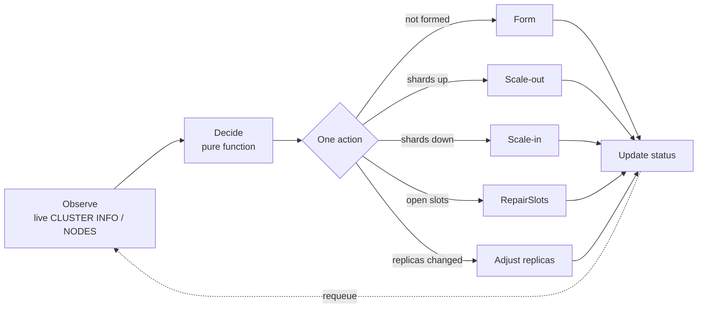

# Reconcile Loop & Edge Cases

A clustering operator's correctness lives in the gaps between "it compiled" and "it survived a real
failover or reshard." This page describes the patterns the reconcile loop uses to stay correct under
crashes, races, partial failures, and concurrent change — and the specific edge cases each one closes.

## The loop, and why its shape matters

Kubernetes reconciliation is **level-triggered**: `Reconcile` is never told *what changed* — it is
told "reconcile this object," reads the full current state, and converges. Two properties follow, and
together they eliminate whole classes of bugs:

- **Idempotent** — safe to run any number of times. Every step reads actual state first and is a
  no-op when the desired state already holds.
- **Convergent** — there are no events to miss; a dropped or duplicated trigger cannot corrupt state,
  because the next reconcile re-derives everything from reality.

The decision step is a **pure function** (`internal/topology.Decide`) — no I/O, exhaustively
unit-tested — so the "what should happen next" logic is verified independently of the messy "talk to a
live cluster" logic.

## Patterns that prevent edge cases

!!! tip "The meta-rule"
    Never act on an assumption you can cheaply verify. Almost every edge case below is closed by
    *reading authoritative state* instead of trusting a name, an ordinal, a count, or a single node's
    gossiped view.

### 1. Read live state first — never assume identity, role, or position

- The primary of a shard is discovered by dialing its pods directly (`CLUSTER MYID`) and matching the
  gossiped slot ownership — **not** assumed to be ordinal 0. After a failover any pod can be primary.
- A "shard" is counted as a **primary that owns slots**, not any master. A replica pod that briefly
  appears as an empty master during formation or resharding is never mistaken for an extra shard.

### 2. Gate on readiness before touching the cluster

If not all shard pods are `Ready`, the operator sets `phase=Provisioning` and requeues **without
issuing any cluster command**. This avoids forming or resharding against a half-present cluster.

### 3. Stability gate — repair before you reshape

Before any topology change, if any slot is open (mid-migration) or coverage is incomplete, the loop
runs `RepairSlots` first and requeues. A reshard issued on top of an unstable cluster is how you get
multi-way open slots that no single command can untangle.

### 4. Bounded, resumable progress

Scale-in drains slots in **bounded batches** and returns after each batch, so the next reconcile
re-reads fresh state and continues. Every batch commits real progress to the cluster. A transient
stall costs one short retry, never a wedged half-migration.

### 5. Query every node where state is not gossiped

Open-slot markers (`[slot->-node]` / `[slot-<-node]`) appear **only on the owning node's own
`CLUSTER NODES` line** — they are not gossiped. Detecting a stuck migration therefore means querying
*every* node and unioning the result, not trusting the seed's view.

### 6. Drive teardown off what exists, not off a derived count

Removing a shard is gated on which **StatefulSets still exist**, not on the live primary count. Once a
departing shard's slots finish draining, the live primary count already equals the desired count — a
count-driven loop would stop and leave the emptied workload behind forever.

### 7. Single writer

Leader election ensures one active controller; cluster formation is guarded by re-reading
`CLUSTER INFO` so two concurrent reconciles cannot both bootstrap.

### 8. Idempotent external operations

Slot migration uses `MIGRATE … REPLACE` (re-copying an already-moved key is harmless) and asserts slot
ownership only on masters (replicas reject `SETSLOT`). Re-running a partially-completed drain converges
rather than erroring.

### 9. Survive write conflicts and transient I/O

Status writes use `RetryOnConflict` (the object may have changed under us). Transient dial/API errors
return an error so controller-runtime **requeues with exponential backoff** rather than busy-looping.

## Concrete edge cases and how they are handled

| Edge case | Why it's dangerous | How the loop handles it |
|---|---|---|
| **Operator crashes mid-reshard** | Slots left half-migrated | On restart, observe → stability gate runs `RepairSlots`; bounded drain resumes from current state |
| **Spec changed while resharding** | Two desired states in flight | Each reconcile re-derives the single next action from *current* state and the *latest* spec; converges to the newest desired topology |
| **Pod rescheduled / IP changes** | Cluster fragments on IP change | Nodes announce a stable hostname; the operator resolves FQDN→IP only for `CLUSTER MEET`; identity persists in `nodes.conf` on the PVC |
| **Fast primary pod restart** | Needless failover + data movement | The same node rejoins before `cluster-node-timeout` and resumes as primary — no promotion, no churn |
| **Replica briefly an empty master** | Counted as a spurious shard; given slots by `rebalance --use-empty-masters` | Only slot-owning masters count as shards; scale-out uses a *targeted* reshard to specific new-primary IDs |
| **Departing shard drained but not deleted** | Empty StatefulSet lingers | Teardown is driven by existing StatefulSets with index ≥ desired |
| **`SETSLOT` on a replica** | Command rejected, drain stalls | Ownership is asserted on masters only; replicas learn via gossip |
| **Stale node lingers in gossip** | go-redis keeps dialing dead pods; entries reappear | A removed node is `FORGET`-ed from **every** surviving pod, not just the seed |
| **Status update conflict** | Reconcile errors on a stale object | `RetryOnConflict` re-reads and retries the status write |
| **Cluster reports `Ready` but rejects a write** | Brief `CLUSTERDOWN` while coverage gossips | Documented client contract: retry on `CLUSTERDOWN` during formation/resharding (most cluster clients do by default) |

## Anti-patterns this design avoids

- **Edge-triggered assumptions** ("a pod was added, therefore do X") — state can have changed again by
  the time you act. Re-derive from current state every time.
- **Unbounded operations** that must complete in one reconcile — they can't be interrupted safely.
  Prefer bounded, resumable steps.
- **Trusting one node's view** of cluster-wide state when the data isn't gossiped.
- **Mutating without re-reading** — the cheapest way to corrupt a cluster is to act on a stale model.
