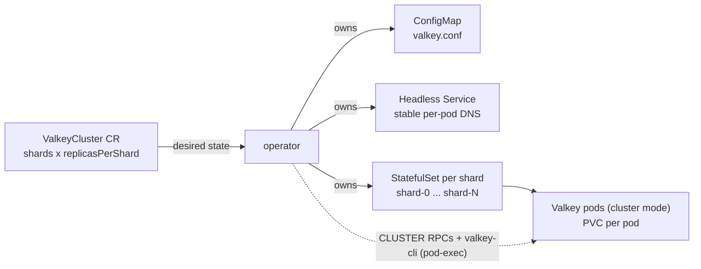

# Architecture

The ValkeyCluster operator turns one custom resource into a running, sharded, highly-available Valkey
cluster, and keeps the live cluster matching the resource as you change it. This page describes how it
is built.

## Background: the Valkey Cluster model

A few facts the design rests on:

- The keyspace is split into **16384 hash slots**; `slot = CRC16(key) mod 16384`. Each **primary**
  owns a range of slots, and together the primaries cover all 16384.
- Each primary has zero or more **replicas** that copy its data asynchronously, for availability.
- Nodes gossip over a cluster-bus port (16379). When a primary is unreachable beyond
  `cluster-node-timeout`, a **majority of primaries** must agree before one of its replicas is
  promoted — so failover needs **≥3 primaries** (with 2 there is no majority).
- "Resharding" means moving slot ownership — and the keys in those slots — between primaries.

## The API: one custom resource

A `ValkeyCluster` is the entire API. Topology is two numbers; everything else is optional tuning.

```yaml
apiVersion: cache.razkevich.dev/v1alpha1
kind: ValkeyCluster
metadata:
  name: demo
spec:
  shards: 3                 # 1 (HA-only) or >=3 (failover quorum)
  replicasPerShard: 1
  image: valkey/valkey:8
  storage: { size: 1Gi }
  resources: { limits: { memory: 512Mi } }
  persistence:
    mode: AOFAndRDB         # AOF | RDB | AOFAndRDB | None
    appendFsync: everysec   # always | everysec | no
  performance:
    ioThreads: 2
    maxmemoryPolicy: noeviction
  haPolicy:
    minReplicasToWrite: 1
    requireFullCoverage: true
    clusterNodeTimeoutMillis: 5000
```

The tuning fields and their tradeoffs are described in
[Settings for Performance and High Availability](settings.md).

The `status` subresource is derived from the live cluster on every reconcile: a `phase`
(`Provisioning → Forming → Ready / Resharding / Degraded`), per-shard primary, slot range, and ready
replicas, plus standard conditions. `kubectl get valkeycluster` is the monitoring surface.

## What the operator creates

For a `ValkeyCluster`, the operator owns (via owner references, so deletion garbage-collects) these
objects:



- **One StatefulSet per shard** (`demo-shard-0`, `demo-shard-1`, …), each with `1 + replicasPerShard`
  pods (`demo-shard-0-0`, `demo-shard-0-1`, …). This makes topology operations map to single objects:
  adding a shard is adding a StatefulSet; scaling replicas is resizing one StatefulSet's pod count.
- **One headless Service** gives every pod a stable DNS name.
- **A ConfigMap** holds the rendered `valkey.conf` (built from the tuning fields above).
- **A PVC per pod** holds `nodes.conf`, so a restarted pod keeps its cluster identity.

Two identity rules make this stable on Kubernetes:

- Each pod **announces its stable hostname** (`cluster-announce-hostname` +
  `cluster-preferred-endpoint-type hostname`), so gossip and client redirects keep working when a pod
  restarts with a new IP.
- A shard's pods get **pod anti-affinity** so a replica isn't scheduled on the same node as its
  primary.

## How the operator talks to Valkey

The operator drives the cluster through a hybrid of three mechanisms:

- **`go-redis`** for inspection and one-shot topology commands: `CLUSTER INFO`, `NODES`, `MEET`,
  `ADDSLOTS`, `REPLICATE`, `FORGET`, `FAILOVER`, `MYID`.
- **`valkey-cli --cluster reshard`** (run inside a pod via the Kubernetes exec API) for **scale-out**
  slot/key migration — a targeted reshard to specific new-primary node IDs.
- **A native Go slot-mover** (`ClusterAdmin.MoveSlots`) for **scale-in** drain:
  `SETSLOT IMPORTING/MIGRATING` → `MIGRATE … REPLACE` (by IP) → `SETSLOT NODE` on masters only, in
  bounded batches. `MIGRATE … REPLACE` is idempotent, so the drain is safe to retry.
- **`ClusterAdmin.RepairSlots`** to finalize any slot left in an intermediate `IMPORTING`/`MIGRATING`
  state.

Two implementation rules worth calling out:

- `CLUSTER MEET` takes an **IP**, not a hostname, so the operator resolves a pod's FQDN → IP for the
  `MEET` call even though the node announces its hostname for everything else.
- A shard's primary is found by dialing pods directly (`CLUSTER MYID`) and matching gossiped slot
  ownership — the operator **never assumes the primary is pod ordinal 0**, since after a failover any
  pod can be the primary.

## The reconcile loop

Reconciliation is **level-triggered** (it is handed an object to reconcile, reads the full current
state, and converges — there are no change-events to miss) and **idempotent** (safe to run any number
of times). Each pass:

```
1. Ensure infra:   ConfigMap, headless Service, one StatefulSet per shard
2. Readiness gate: if not all pods Ready -> phase=Provisioning, requeue (don't touch the cluster)
3. Observe:        read live ClusterState via go-redis (CLUSTER INFO + NODES)
4. Decide:         topology.Decide(desired, observed) -> one action
5. Act:            Form | Repair | ScaleOut | ScaleIn | ScaleReplicas | (steady) reconcile membership
6. Status:         re-observe and publish phase / conditions / per-shard detail
```

The decision is a pure function (no I/O, fully unit-tested):

```go
func Decide(desired Desired, observed Observed) Plan {
    if !observed.Formed         { return Plan{Kind: Form} }
    if !observed.SlotsCovered   { return Plan{Kind: Repair} }   // stability gate
    if desired.Shards > observed.PrimaryCount { return Plan{ScaleOutShards, ...} }
    if desired.Shards < observed.PrimaryCount { return Plan{ScaleInShards, ...} }
    if replicaCountsDiffer(...)               { return Plan{ScaleReplicas, ...} }
    return Plan{Kind: None}
}
```

A "shard" is counted as a **primary that owns slots** — a replica pod briefly appearing as an empty
master is not mistaken for an extra shard. How the loop stays correct under crashes, races, and
partial failures is detailed in [Reconcile Loop & Edge Cases](reconcile-edge-cases.md).

## The testability seam

One interface decouples the reconciler from a live cluster:

```go
type ClusterAdmin interface {
    State(ctx, seed) (ClusterState, error)
    Meet / AddSlots / Replicate / Forget / Failover / MyID ...
    Reshard / MoveSlots / RepairSlots ...
}
```

Production uses a `go-redis` + pod-exec implementation; tests use an in-memory **fake**. The
reconciler's "given this state, take these actions" logic runs in `envtest` (a real API server, no
kubelet) against the fake, and real Valkey behavior is verified separately in kind e2e. See
[Testing & Verification](manual-verification.md).

## Day-2 operations

| Operation | What happens |
|---|---|
| **Provision** | Create StatefulSets → wait for pods Ready → `MEET` all nodes, split 16384 slots across primaries, `REPLICATE` the replicas → `Ready`. |
| **Scale out** (`shards ↑`) | Join the new primaries, targeted reshard moves them their slot share + keys, attach their replicas. |
| **Scale in** (`shards ↓`) | Drain departing shards' slots onto survivors first, then `FORGET` the nodes and delete their StatefulSet + PVCs. |
| **Scale replicas** | Resize each shard's StatefulSet and attach/forget replicas; no keyspace movement. |
| **Failover** | Valkey promotes a replica when a primary is unreachable beyond `cluster-node-timeout`; the operator reflects the new roles and re-joins the recovered pod. A quick pod restart returns before the timeout and resumes as primary. |
| **Self-heal** | A deleted StatefulSet is recreated; open slots left by an interrupted reshard are closed by `RepairSlots` on the next reconcile. |
| **Teardown** | A finalizer drains/forgets nodes and reclaims PVCs; owner references GC the rest. |

The runbook with commands is in [Day-2 Operations](day-2-operations.md).

## Scope

In scope: sharding, replication, data-preserving resharding (grow and shrink), failover handling, and
truthful status. Out of scope by design: rolling version upgrades, vertical scaling, volume expansion,
backup/restore, TLS/ACL, Sentinel (cluster-mode failover covers HA, and `shards: 1` is the
HA-only case), proxies, and a metrics stack (the monitoring surface is `kubectl`).
